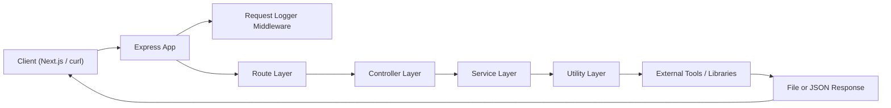
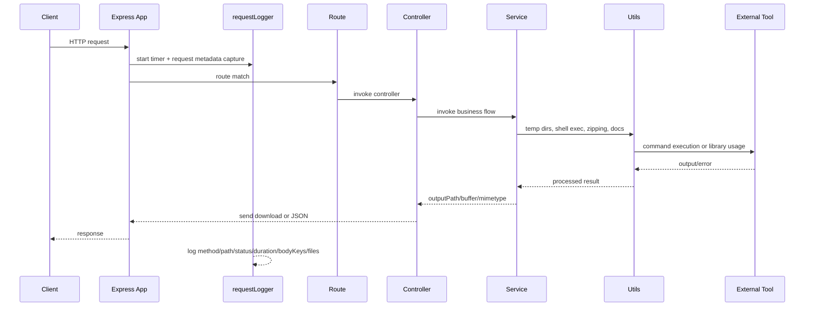
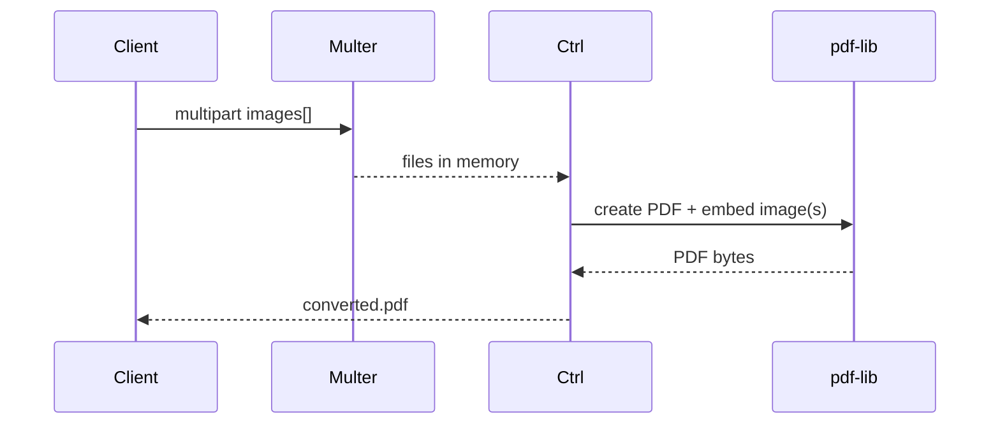
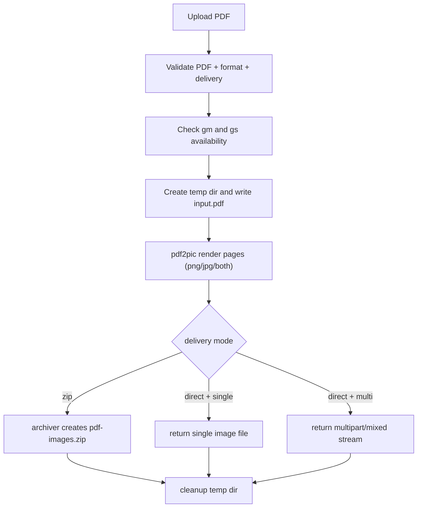
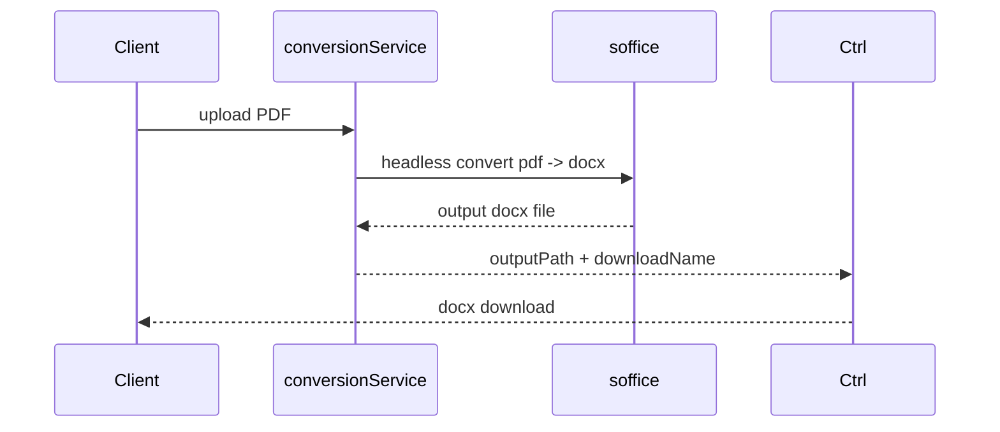
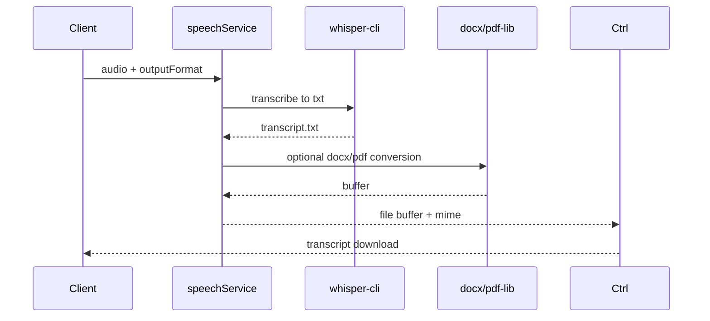
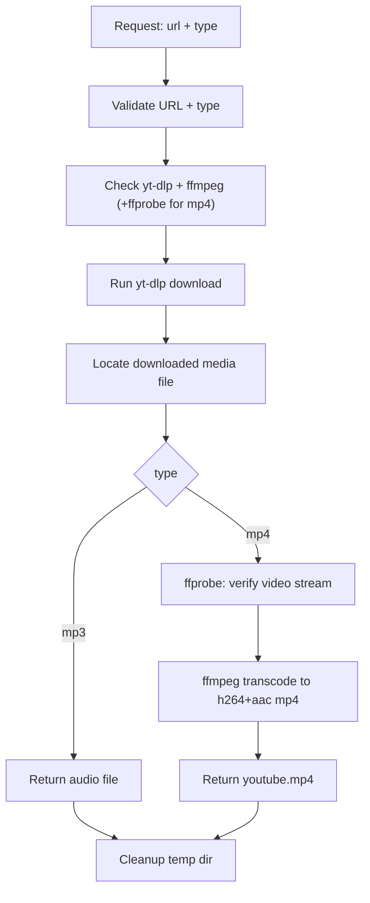

Great request. Here is the real request-flow architecture for your current backend.

## Core architecture
Key code locations:
- `/Users/aditya4/Desktop/Technolaza/backend/app.js`
- `/Users/aditya4/Desktop/Technolaza/backend/middleware/requestLogger.js`
- `/Users/aditya4/Desktop/Technolaza/backend/middleware/upload.js`
- `/Users/aditya4/Desktop/Technolaza/backend/routes/convertRoutes.js`
- `/Users/aditya4/Desktop/Technolaza/backend/routes/speechRoutes.js`
- `/Users/aditya4/Desktop/Technolaza/backend/routes/youtubeRoutes.js`
- `/Users/aditya4/Desktop/Technolaza/backend/controllers/convertController.js`
- `/Users/aditya4/Desktop/Technolaza/backend/controllers/speechController.js`
- `/Users/aditya4/Desktop/Technolaza/backend/controllers/youtubeController.js`
- `/Users/aditya4/Desktop/Technolaza/backend/services/conversionService.js`
- `/Users/aditya4/Desktop/Technolaza/backend/services/speechService.js`
- `/Users/aditya4/Desktop/Technolaza/backend/services/youtubeService.js`
- `/Users/aditya4/Desktop/Technolaza/backend/utils/command.js`
- `/Users/aditya4/Desktop/Technolaza/backend/utils/tempFiles.js`
- `/Users/aditya4/Desktop/Technolaza/backend/utils/zip.js`
- `/Users/aditya4/Desktop/Technolaza/backend/utils/textDocs.js`
- `/Users/aditya4/Desktop/Technolaza/backend/utils/sendDownload.js`

## Shared request lifecycle (every endpoint)

---

## Endpoint-by-endpoint deep flow

## 1) Image -> PDF (`POST /api/convert/images-to-pdf`)
Packages/tools:
- `multer` (in-memory upload)
- `pdf-lib` (embed JPG/PNG into PDF)

Flow:
1. `convertRoutes` applies `upload.array('images', 20)`.
2. `convertController.imagesToPdfController` sends files to `convertImagesToPdf`.
3. `conversionService.convertImagesToPdf` validates each image type.
4. For each file:
   - `embedPng` or `embedJpg`
   - adds one page sized exactly to image dimensions
   - draws image at `x=0,y=0`
5. Returns PDF bytes to controller.
6. Controller sends `Content-Type: application/pdf` with attachment name `converted.pdf`.

---

## 2) PDF -> Images (`POST /api/convert/pdf-to-images`)
Packages/tools:
- `pdf2pic`
- GraphicsMagick (`gm`)
- Ghostscript (`gs`)
- `archiver` (zip mode)

Flow:
1. `upload.single('file')` receives PDF.
2. `convertPdfToImages` validates:
   - file is PDF
   - `format` is `png|jpg|both`
   - `delivery` is `zip|direct`
   - `gm` and `gs` exist.
3. Creates OS temp dir (`mkdtemp`) and writes `input.pdf`.
4. Runs `pdf2pic.fromPath(...).bulk(-1)` for each requested format.
5. Collects generated files.
6. If `delivery=zip`:
   - uses `createZipArchive` -> `pdf-images.zip`
   - sends zip download.
7. If `delivery=direct`:
   - one image: sends that image directly
   - many images: streams `multipart/mixed` response with image parts.
8. Always cleans temp dir after response.

---

## 3) PDF -> Word (`POST /api/convert/pdf-to-word`)
Tools:
- LibreOffice `soffice` CLI (`--headless --infilter=writer_pdf_import --convert-to docx`)

Flow:
1. Validates uploaded file is PDF.
2. Resolves `soffice` path (`SOFFICE_BIN` or default app/system path).
3. Writes PDF to temp dir.
4. Executes conversion command.
5. Locates generated `.docx`.
6. Sends docx as download.
7. Cleans temp dir.

---

## 4) PNG <-> JPG (`POST /api/convert/image-format`)
Package:
- `sharp`

Flow:
1. Validates input file exists and `targetFormat` is `png|jpg|jpeg`.
2. Runs:
   - `sharp(...).png()` for PNG
   - `sharp(...).jpeg({quality:92})` for JPG
3. Returns converted image bytes directly with proper mime type.

---

## 5) Voice -> Text (`POST /api/speech/voice-to-text`)
Tools/packages:
- `whisper-cli`
- Whisper model (`ggml-base.en.bin`)
- `docx` package (for transcript docx)
- `pdf-lib` text rendering (for transcript pdf)

Flow:
1. Validates audio file exists.
2. Resolves whisper binary and model path.
3. Writes uploaded audio to temp dir.
4. Runs:
   - `whisper-cli -m <model> -f <audio> -of <base> -otxt`
5. Reads generated transcript text file.
6. Converts output:
   - `txt`: raw text
   - `docx`: `textToDocxBuffer`
   - `pdf`: `textToPdfBuffer`
7. Sends file response.
8. Cleans temp dir in `finally`.

---

## 6) Text/PDF/DOCX -> Voice (`POST /api/speech/to-voice`)
Tools/packages:
- `pdf-parse` (PDF text extraction)
- `mammoth` (DOCX text extraction)
- OS TTS:
  - macOS `say`
  - Linux `espeak`
- `ffmpeg` (convert raw AIFF/WAV into MP3/WAV/AIFF target)

Flow:
1. Accepts either `text` field or uploaded `file`.
2. `extractTextFromInput`:
   - text: use directly
   - pdf: parse with `PDFParse.getText()`
   - docx: parse with mammoth
   - txt: decode utf-8
3. `synthesizeSpeech`:
   - mac: `say -f input.txt -o speech.aiff`
   - linux: `espeak -f input.txt -w speech.wav`
4. If target format differs from raw output, converts with ffmpeg.
5. Sends audio download and cleans temp dir.

---

## 7) YouTube Download (`POST /api/youtube/download`)
Tools:
- `yt-dlp`
- `ffmpeg`
- `ffprobe`

Your current MP4 flow in code:
1. Validates YouTube URL and `type`.
2. Ensures tools exist.
3. Runs `yt-dlp` with format selection:
   - MP3: `-x --audio-format mp3`
   - MP4: preference chain for mp4-compatible video/audio + `--merge-output-format mp4`
4. Finds downloaded media file in temp dir.
5. For MP4:
   - runs `ffprobe` to ensure video stream exists
   - then transcodes to universally playable MP4:
     - video: `libx264` + `yuv420p`
     - audio: `aac`
     - `+faststart`
6. Sends final file (`youtube.mp4` / `youtube.mp3`) and cleans temp dir.

---

## Cross-cutting behaviors

1. Upload handling:
- `multer.memoryStorage()`
- `100MB` file limit, `30` files global, `20` images for images->pdf route.

2. Temp file strategy:
- OS temp via `mkdtemp` (`utils/tempFiles.js`)
- cleaned after response (`sendDownloadAndCleanup` / controller `finally`).

3. Shell execution wrapper:
- `runCommand` captures stdout/stderr and normalizes errors to `HttpError`.

4. Error contract:
- uniform JSON: `{"message":"..."}` from `errorHandler`.

5. Logging:
- JSON line per request including endpoint, status, duration, and uploaded file metadata.

---

If you want, I can also generate a dedicated `ARCHITECTURE.md` in the repo with these Mermaid diagrams so your team can keep it versioned.
